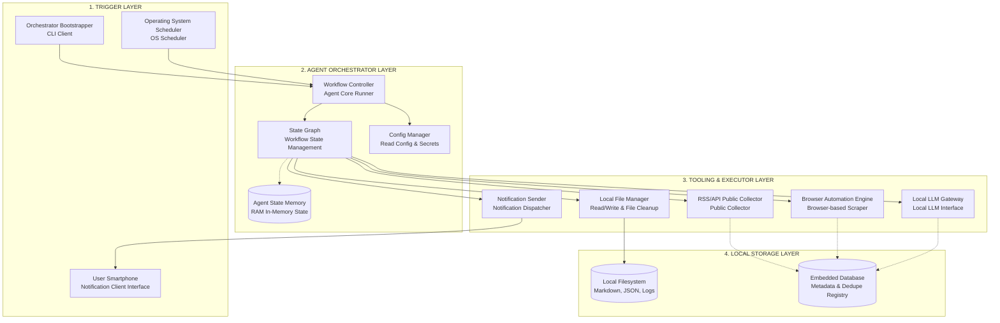
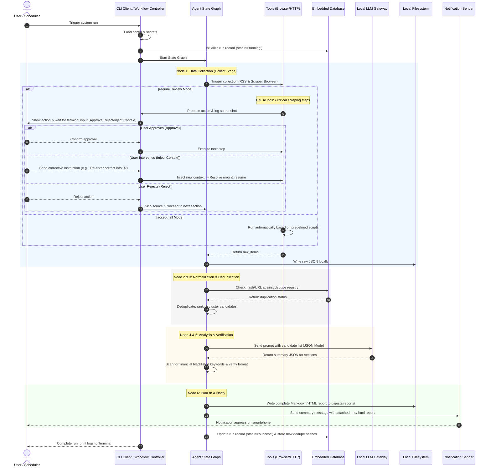

# System Architecture V1 - Pure Logical Design

## Design Principles

- **Local-first & Standalone Execution**: The entire system runs directly as a standalone CLI execution unit, operating internally on the user's local environment. No web servers or intermediary API gateways are used.
- **File-based & Embedded DB (Minimalist Storage)**: The output Markdown digests are stored directly as physical files. A local file-based embedded database is utilized to store metadata and manage execution history for optimal performance.
- **Agentic Workflow (State Graph)**: The operational flow is defined as an Agent State Graph. Each node in the graph accepts the current in-memory state, calls its corresponding logic tool, updates the state, and decides the next step.
- **Supervised Browser Automation**: Browser automation is used to interact directly with web interfaces showing the data (utilizing secondary accounts to avoid security risks).
- **Human-in-the-loop & Adaptive Context (Action Review & Intervention)**: Provides two operating modes: fully automatic (`accept_all`) and review-required (`require_review`). It allows the user to intervene directly from the console to inject corrective context (Adaptive Context) when errors occur (wrong input, captcha) to avoid infinite error loops.
- **Structured Output & Citations**: Analyzes data using a local LLM to extract structured JSON before rendering it to Markdown. All summarized critical information must include source citations/links.

---

## Logical Architecture Overview

The diagram below represents the relationships between logical system components, independent of the concrete implementation technology:

---

## Detailed Component Breakdown

### 1. Trigger Layer
*   **CLI Client**: The main command-line interface, accepting user inputs to run manual execution parameters (such as dry-runs or selecting specific sections).
*   **Operating System Scheduler**: An OS-level scheduler that automatically triggers the execution script daily according to configured time slots.
*   **User Smartphone**: The device that receives the summary notification at the end of the day with the detailed report file attached.

### 2. Agent Orchestrator Layer
*   **Workflow Controller**: The system entry point, loading environment variables/configurations and starting the state graph.
*   **State Graph & State Memory**: The coordinator of sequential logical workflow through functional nodes (Collect -> Normalize & Deduplicate -> Rank & Cluster -> Summarize -> Verify -> Publish). RAM stores intermediate state variables passed between nodes to ensure execution session integrity.

### 3. Tooling & Executor Layer
*   **RSS/API Public Collector**: Configures HTTP client connections to retrieve data from public RSS feeds or public APIs.
*   **Browser Automation Engine**: A browser emulator performing operations like opening web pages and logging into dedicated user accounts to collect visible market/stock details. The system runs in read-only mode and does not click transaction buttons.
*   **Local LLM Gateway**: A standardized interface connecting to the local large language model. It manages prompt construction and enforces JSON Mode outputs.
*   **Notification Sender**: Client responsible for packing summary content and dispatching it directly with the detailed report to the user's smartphone.
*   **Local File Manager**: Handles reading/writing raw data (.json) and final digests (.md). Performs cleanup of expired locally archived files.

### 4. Local Storage Layer
*   **Local Filesystem**: Physical file storage containing Markdown/HTML reports (`storage/digests/reports/`), raw data (`storage/digests/raw/`), and logs with audit screenshots (`storage/logs/`).
*   **Embedded Database**: A file-based embedded database storing run metadata (`runs`) and duplicate tracking indexes (`dedupe_registry`) based on article content hashes.

---

## Detailed Data and Control Flow

The sequence diagram describing the logical execution:

---

## Review & Intervention Mechanisms (Human-in-the-loop & Adaptive Context)

1.  **Local Interactive Interface**: Interaction uses a direct standard input stream from the console (`input()`). When the system pauses, it prints the proposed action and saves screenshots to the log folder of the active run session, allowing the user to view it on their local machine.
2.  **Context Injection**: If the user chooses to intervene (Inject Context), the system accepts the input string and injects it as an "additional instruction" directly into the browser planner to steer the Agent's behavior, recovering from input typos or abnormal UI changes.
