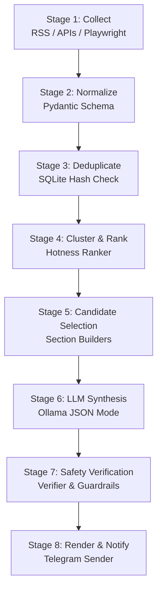

# AI Pipeline V1

## 1. Pipeline Goals

The processing pipeline is designed to transform daily raw data collected from various sources into a structured, concise, and clearly cited Vietnamese newsletter delivered directly to the user's smartphone.

In version V1, the pipeline prioritizes stability, information traceability, and hallucination control over fully automated, unsupervised execution.

---

## 2. Core Inputs & Outputs

### Inputs:
- `config/sources.yaml`: Contains news sources, topics, reliability levels, and collection methods.
- `config/app.yaml`: Runtime configurations, timezone, local LLM, Telegram channels, and scoring thresholds.
- Historical data in SQLite: Table storing hashes of previously scraped articles/repos to filter duplicates.
- Endpoint of the local LLM runtime (Ollama).

### Outputs:
- `storage/digests/raw/raw_items_{date}.json`: Raw data scraped from the run.
- `storage/digests/reports/digest_{date}.json`: Structured summary newsletter in JSON format.
- `storage/digests/reports/digest_{date}.md`: Detailed report in Markdown format.
- `storage/digests/reports/digest_{date}.html`: Detailed report in HTML format (responsive for reading on smartphones).
- Brief summary notification and attached `.md` / `.html` files dispatched via Telegram Bot.
- Run metrics and browser audit logs stored locally.

---

## 3. Pipeline Stages

### Stage 1: Collect
*   **Goal:** Retrieve new daily data from configured sources.
*   **Inputs:** Sources configuration, execution time, and history.
*   **Core Processing:** 
    *   Asynchronous fetching from RSS feeds and public APIs (arXiv, GitHub).
    *   Launch automated browser (Playwright) to harvest stock/gold rates from dedicated secondary accounts.
    *   **Review & Intervention (Human-in-the-loop):** If running in `require_review` mode, Playwright pauses before critical login/click steps, saves a screenshot to the log, and waits for keyboard inputs from the console (`Approve` / `Reject` / `Inject Context`). If the user selects `Inject Context`, they can type correction instructions (e.g., providing a captcha code or new password) to guide the Agent and resume the run.
*   **Outputs:** List of raw data items (`raw_items`).
*   **Risks / Control Points:** Broken sources, websites blocking bots, login failures. Resolved via direct terminal manual intervention.

### Stage 2: Normalize
*   **Goal:** Unify all raw data formats into a single database/code schema.
*   **Inputs:** `raw_items` from Stage 1.
*   **Core Processing:**
    *   Schema synchronization: Title (`title`), raw/summarized content (`summary`), author/source (`source`), link (`url`), publication date (`published_at`), and topic (`topic`).
    *   Resolve canonical URLs to standardize links.
    *   Identify language and extract basic entities (stock symbols, countries, technology keywords).
*   **Outputs:** List of normalized items (`normalized_items`).

### Stage 3: Deduplicate
*   **Goal:** Remove daily duplicate news and avoid reporting articles published within the last 7 days.
*   **Inputs:** `normalized_items` and historical hashes in SQLite.
*   **Core Processing:**
    *   Absolute deduplication using URLs and unique identifiers (e.g., `arxiv_id`, `repo_id`).
    *   Fuzzy deduplication based on title similarity (using basic string matching algorithms like Gestalt Pattern Matching) or content hashes.
*   **Outputs:** List of unique items.

### Stage 4: Rank and Cluster
*   **Goal:** Select the most outstanding information items to forward to the LLM.
*   **Inputs:** Unique items list.
*   **Core Processing:**
    *   **Clustering:** Group articles covering the same event/topic to avoid repetitive points.
    *   **Scoring (Hotness Ranker):** Score hotness based on recency, source credibility, market impact, and matching cluster sizes.
    *   **GitHub/arXiv:** Score based on stars and relevance to the preconfigured AI keywords.
*   **Outputs:** Shortlisted candidates for each section (`candidate_items`).

### Stage 5: Section Builders via LLM
*   **Goal:** Utilize the local LLM to generate structured summaries in Vietnamese for each section.
*   **Inputs:** Shortlisted candidate items for each section.
*   **Core Processing:**
    *   Segment data by section (Politics/Current News, Stocks/Markets, Stock Watchlist, AI Papers, GitHub Repos) before calling the LLM. This prevents VRAM overflows by keeping the context window below 8K tokens.
    *   Enforce JSON structured outputs from the LLM by enabling **JSON Mode** in Ollama.
    *   LLM constraints: Absolutely no fabricated statistics, and every key assertion must be cited with source index numbers (`citations`).
*   **Outputs:** Summarized JSON result for each section.

### Stage 6: Verification & Safety Guardrails
*   **Goal:** Review content quality and enforce financial safety compliance before publishing.
*   **Inputs:** JSON outputs from the LLM in Stage 5.
*   **Core Processing:**
    *   **JSON Validation:** Parse data using Pydantic. If validation fails, trigger the self-correction mechanism (re-invoking the LLM with the error message to regenerate the JSON, up to 1 retry).
    *   **Citation Verification:** Verify that the cited source IDs in the generated text actually exist in the initial raw data. Strip out any uncited claims.
    *   **Financial Banned Words Scan:** Apply regex rules and LLM scans on the Stock Watchlist section. Remove trading terms promising returns or urging buying/selling, and append standard legal disclaimers.
*   **Outputs:** Fully approved digest data structure.

### Stage 7: Render & Notify
*   **Goal:** Write output files locally and send notifications to the user's smartphone.
*   **Inputs:** Approved digest data structure.
*   **Core Processing:**
    *   Render the JSON data into a detailed Markdown file (`digest_{date}.md`) and a responsive HTML file (`digest_{date}.html`), saving them under `storage/digests/reports/`.
    *   Extract a brief summary (5-10 highlights).
    *   Trigger the Telegram Bot to send the rich-text summary with the `.md` / `.html` report files directly to the user's chat.
*   **Outputs:** Report saved locally and notification sent successfully.
