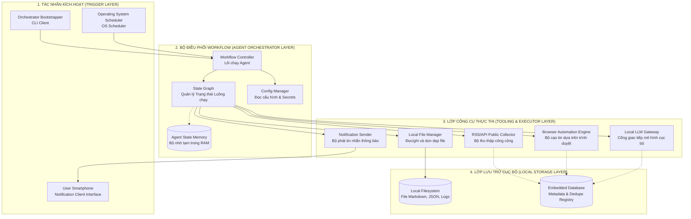
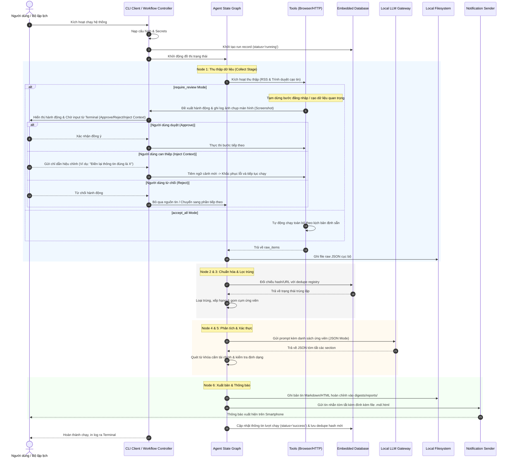

# Kiến trúc hệ thống (System Architecture) V1 - Thiết kế Logic thuần túy

## Nguyên tắc thiết kế

- **Local-first & Standalone Execution**: Toàn bộ hệ thống chạy trực tiếp dưới dạng một bộ thực thi dòng lệnh độc lập, hoạt động nội bộ trên môi trường cục bộ của người dùng. Không sử dụng Web Server hay các cổng API trung gian.
- **Tối giản lưu trữ dữ liệu (File-based & Embedded DB)**: Lưu trữ các bản tin Markdown đầu ra trực tiếp dưới dạng file vật lý. Sử dụng cơ sở dữ liệu nhúng (Embedded Database) dạng tệp cục bộ để lưu trữ metadata và quản lý lịch sử chạy để tối ưu hiệu năng.
- **Agentic Workflow (State Graph)**: Định cấu hình luồng hoạt động dưới dạng đồ thị trạng thái Agent (State Graph). Mỗi nút trong đồ thị nhận trạng thái hiện tại (In-Memory State), gọi công cụ logic tương ứng, cập nhật trạng thái và quyết định bước tiếp theo.
- **Tự động hóa trình duyệt có giám sát (Supervised Browser Automation)**: Sử dụng công cụ tự động hóa trình duyệt để tương tác trực tiếp với các trang web hiển thị dữ liệu (sử dụng tài khoản riêng biệt để tránh rủi ro bảo mật).
- **Human-in-the-loop & Adaptive Context (Duyệt hành động & Can thiệp)**: Cung cấp hai cơ chế vận hành: tự động hoàn toàn (`accept_all`) và duyệt có phê duyệt (`require_review`). Cho phép người dùng can thiệp trực tiếp từ console để tiêm ngữ cảnh hiệu chỉnh (Adaptive Context) khi xảy ra lỗi (nhập sai thông tin, captcha) nhằm tránh vòng lặp lỗi vô tận.
- **Đầu ra có cấu trúc & Rõ nguồn**: Phân tích dữ liệu bằng mô hình ngôn ngữ lớn cục bộ để trích xuất JSON có cấu trúc trước khi kết xuất ra Markdown. Mọi thông tin quan trọng được tổng hợp bắt buộc phải có liên kết nguồn (citations).

---

## Kiến trúc tổng quan (Logical Architecture Overview)

Sơ đồ dưới đây thể hiện mối quan hệ giữa các thành phần logic của hệ thống mà không phụ thuộc vào công nghệ hiện thực:

---

## Chi tiết các thành phần trong các phân lớp (Detailed Component Breakdown)

### 1. Tác nhân kích hoạt (Trigger Layer)
*   **CLI Client**: Giao diện dòng lệnh chính, chấp nhận đầu vào của người dùng để thực thi các tham số chạy thủ công (như chạy thử, chọn section cụ thể).
*   **Operating System Scheduler**: Bộ lập lịch mức hệ điều hành, tự động gọi script thực thi hàng ngày theo cấu hình thời gian định sẵn.
*   **User Smartphone**: Thiết bị nhận thông báo tóm tắt cuối ngày kèm tệp tin báo cáo chi tiết.

### 2. Bộ điều phối Workflow (Agent Orchestrator Layer)
*   **Workflow Controller**: Điểm khởi tạo hệ thống, nạp các biến môi trường cấu hình và khởi động đồ thị trạng thái.
*   **State Graph & State Memory**: Bộ điều phối luồng logic tuần tự qua các nút chức năng (Nút thu thập -> Nút xử lý & lọc trùng -> Nút xếp hạng -> Nút tổng hợp -> Nút xác thực -> Nút xuất bản). Bộ nhớ RAM lưu trữ trạng thái trung gian truyền giữa các nút để đảm bảo tính toàn vẹn của phiên chạy.

### 3. Lớp Công cụ Thực thi (Tooling & Executor Layer)
*   **RSS/API Public Collector**: Bộ cài đặt các kết nối HTTP Client để đọc dữ liệu từ các luồng RSS công khai hoặc các API công cộng.
*   **Browser Automation Engine**: Bộ giả lập trình duyệt, thực hiện các thao tác mở trang web, đăng nhập vào tài khoản chuyên dụng của người dùng để thu thập thông tin trực quan. Hệ thống hoạt động dưới chế độ chỉ đọc dữ liệu hiển thị (Read-only) và không thực thi các nút bấm giao dịch.
*   **Local LLM Gateway**: Cổng giao tiếp chuẩn hóa với mô hình ngôn ngữ lớn cục bộ. Cung cấp cơ chế định hình prompt và chế độ bắt buộc xuất ra JSON (JSON Mode).
*   **Notification Sender**: Client chịu trách nhiệm đóng gói nội dung tóm tắt và gửi trực tiếp cùng tệp báo cáo chi tiết đến smartphone của người dùng.
*   **Local File Manager**: Đọc ghi dữ liệu thô (.json) và báo cáo cuối cùng (.md). Thực hiện dọn dẹp các tệp cũ quá hạn lưu trữ cục bộ.

### 4. Lớp Lưu trữ Cục bộ (Local Storage Layer)
*   **Local Filesystem**: Lưu trữ tệp vật lý gồm bản tin Markdown/HTML (`storage/digests/reports/`), dữ liệu thô (`storage/digests/raw/`) và nhật ký cùng ảnh chụp màn hình audit (`storage/logs/`).
*   **Embedded Database**: Cơ sở dữ liệu nhúng dạng tệp cục bộ dùng để lưu trữ trạng thái chạy (`runs`) và đăng ký lọc trùng (`dedupe_registry`) dựa trên mã băm nội dung bài viết.

---

## Luồng dữ liệu và Luồng điều khiển chi tiết (Data and Control Flow)

Sơ đồ tuần tự mô tả các hành động logic:

---

## Cơ chế Duyệt & Can thiệp (Human-in-the-loop & Adaptive Context)

1.  **Giao diện Tương tác Cục bộ**: Việc tương tác sử dụng luồng input trực tiếp từ console (`input()`). Khi hệ thống tạm dừng, nó in hành động dự kiến và lưu ảnh chụp màn hình vào thư mục logs của phiên chạy để người dùng mở xem trực tiếp trên máy.
2.  **Tiêm ngữ cảnh (Context Injection)**: Nếu người dùng chọn chức năng hiệu chỉnh (Inject Context), hệ thống nhận chuỗi ký tự nhập vào, chèn nó làm "chỉ thị bổ sung" trực tiếp vào bộ lập kế hoạch trình duyệt để định hướng lại hành động của Agent, giúp Agent phục hồi khỏi các lỗi nhập sai hoặc thay đổi giao diện bất thường.
