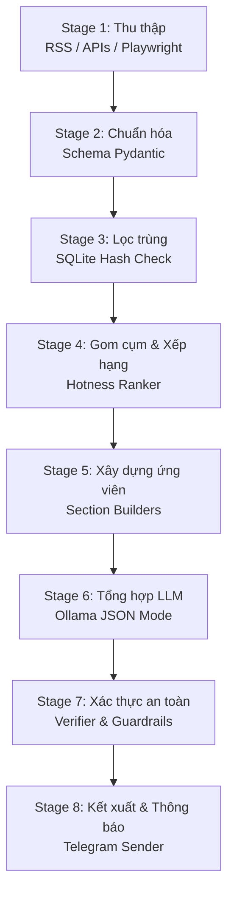

# Pipeline Trí tuệ Nhân tạo (AI Pipeline) V1

## 1. Mục tiêu Pipeline

Pipeline xử lý được thiết kế để biến đổi dữ liệu thô thu thập trong ngày từ nhiều nguồn khác nhau thành một bản tin tiếng Việt có cấu trúc, ngắn gọn, có nguồn dẫn rõ ràng và gửi đến smartphone của người dùng. 

Trong phiên bản V1, pipeline ưu tiên tính ổn định, khả năng truy vết nguồn gốc thông tin và kiểm soát hiện tượng ảo tưởng (hallucination) hơn là tự động hóa hoàn toàn mà không có kiểm soát.

---

## 2. Dữ liệu Đầu vào & Đầu ra chính

### Đầu vào (Inputs):
- `config/sources.yaml`: Danh sách nguồn tin, chủ đề, độ tin cậy và phương thức thu thập.
- `config/app.yaml`: Cấu hình thời gian chạy, múi giờ, model LLM cục bộ, kênh Telegram và các ngưỡng chấm điểm.
- Dữ liệu lịch sử lưu trong SQLite: Bảng lưu hash các tin bài/repo đã cạo trước đó để lọc trùng.
- Endpoint của mô hình LLM cục bộ (Ollama).

### Đầu ra (Outputs):
- `storage/digests/raw/raw_items_{date}.json`: Dữ liệu thô cạo được của lượt chạy.
- `storage/digests/reports/digest_{date}.json`: Bản tin tóm tắt có cấu trúc dữ liệu JSON.
- `storage/digests/reports/digest_{date}.md`: Bản tin chi tiết định dạng Markdown.
- `storage/digests/reports/digest_{date}.html`: Bản tin chi tiết định dạng HTML (đáp ứng responsive giúp đọc tốt trên smartphone).
- Tin nhắn thông báo ngắn gọn và file `.md` / `.html` đính kèm được gửi qua Telegram Bot.
- Run metrics và nhật ký audit log của trình duyệt lưu cục bộ.

---

## 3. Các giai đoạn xử lý (Pipeline Stages)

### Stage 1: Thu thập (Collect)
*   **Mục tiêu:** Lấy dữ liệu mới trong ngày từ các nguồn đã cấu hình.
*   **Đầu vào:** Cấu hình nguồn tin, thời gian chạy và lịch sử.
*   **Xử lý chính:** 
    *   Tải tin song song từ các RSS feed và API công cộng (arXiv, GitHub).
    *   Khởi chạy trình duyệt tự động (Playwright) để thu thập giá chứng khoán/vàng từ các tài khoản phụ chuyên dụng.
    *   **Cơ chế Duyệt & Can thiệp (Human-in-the-loop):** Nếu chạy ở chế độ `require_review`, Playwright sẽ dừng trước các bước đăng nhập/click quan trọng, chụp ảnh màn hình lưu vào log và chờ xác nhận từ bàn phím console (`Approve` / `Reject` / `Inject Context`). Nếu người dùng chọn `Inject Context`, họ có thể nhập chỉ dẫn sửa lỗi (ví dụ: cung cấp mã captcha hoặc mật khẩu mới) để Agent tự sửa hành vi và chạy tiếp.
*   **Đầu ra:** Danh sách các mục dữ liệu thô (`raw_items`).
*   **Rủi ro kiểm soát:** Nguồn tin lỗi, website chặn bot, lỗi đăng nhập tài khoản. Giải quyết thông qua cơ chế can thiệp trực tiếp từ console.

### Stage 2: Chuẩn hóa (Normalize)
*   **Mục tiêu:** Đưa mọi mục dữ liệu thô về một cấu trúc (schema) dữ liệu chung.
*   **Đầu vào:** `raw_items` thu được ở Stage 1.
*   **Xử lý chính:**
    *   Đồng bộ cấu trúc: Tiêu đề (`title`), nội dung thô/tóm tắt (`summary`), tác giả/nguồn (`source`), liên kết (`url`), ngày đăng (`published_at`), chủ đề (`topic`).
    *   Xác định canonical URL để quy chuẩn liên kết.
    *   Phát hiện ngôn ngữ và trích xuất các thực thể cơ bản (mã cổ phiếu, quốc gia, tên công nghệ).
*   **Đầu ra:** Danh sách các mục dữ liệu chuẩn hóa (`normalized_items`).

### Stage 3: Lọc trùng (Deduplicate)
*   **Mục tiêu:** Loại bỏ các tin bài trùng lặp trong ngày và tránh đưa lại thông tin đã được báo cáo trong vòng 7 ngày qua.
*   **Đầu vào:** `normalized_items` và dữ liệu băm lịch sử trong SQLite.
*   **Xử lý chính:**
    *   Lọc trùng tuyệt đối bằng URL và mã định danh duy nhất (như `arxiv_id`, `repo_id`).
    *   Lọc trùng tương đối (Fuzzy match) bằng cách tính độ tương đồng tiêu đề (Sử dụng thuật toán so khớp chuỗi cơ bản như Gestalt Pattern Matching) hoặc so sánh content hash.
*   **Đầu ra:** Danh sách tin bài duy nhất.

### Stage 4: Gom cụm và Xếp hạng (Rank and Cluster)
*   **Mục tiêu:** Xác định và chọn ra các thông tin thực sự nổi bật nhất để chuyển sang LLM.
*   **Đầu vào:** Danh sách tin bài duy nhất.
*   **Xử lý chính:**
    *   **Gom cụm:** Nhóm các bài viết đưa tin về cùng một sự kiện/chủ đề để tránh lặp ý.
    *   **Xếp hạng (Scoring):** Chấm điểm độ nóng (Hotness Score) dựa trên độ mới, độ tin cậy của nguồn và số lượng bài viết độc lập cùng gom cụm trong nhóm.
    *   **GitHub/arXiv:** Chấm điểm dựa trên số lượng ngôi sao (stars), độ tương quan chủ đề AI đã cấu hình.
*   **Đầu ra:** Danh sách ứng viên rút gọn cho mỗi phân mục (`candidate_items`).

### Stage 5: Tổng hợp LLM theo từng phân mục (Section Builders via LLM)
*   **Mục tiêu:** Sử dụng LLM cục bộ để viết tóm tắt có cấu trúc tiếng Việt cho từng phân mục tin tức.
*   **Đầu vào:** Danh sách ứng viên rút gọn cho mỗi phân mục.
*   **Xử lý chính:**
    *   Chia nhỏ dữ liệu theo từng phân mục (Chính trị/Thời sự, Chứng khoán/Thị trường, Watchlist cổ phiếu, AI Paper, GitHub Repos) để gửi tới LLM. Việc chia nhỏ giúp kiểm soát độ dài ngữ cảnh (Context Window) dưới 8K tokens để tránh tràn VRAM của máy cục bộ.
    *   Yêu cầu mô hình LLM viết tóm tắt ngắn gọn dưới dạng JSON có cấu trúc bằng cách bật **JSON Mode** trên Ollama.
    *   Ràng buộc LLM: Không được tự bịa số liệu, mọi phân tích quan trọng bắt buộc phải đi kèm trích dẫn số thứ tự nguồn (`citations`).
*   **Đầu ra:** Kết quả phân tích JSON của từng phân mục.

### Stage 6: Xác thực an toàn (Verification & Safety Guardrails)
*   **Mục tiêu:** Rà soát chất lượng nội dung và an toàn tài chính trước khi xuất bản.
*   **Đầu vào:** JSON đầu ra từ LLM ở Stage 5.
*   **Xử lý chính:**
    *   **Xác thực JSON:** Đọc và parse dữ liệu bằng thư viện Pydantic. Nếu phát hiện lỗi định dạng, kích hoạt cơ chế tự động sửa lỗi (gửi kèm thông báo lỗi để gọi LLM sinh lại JSON 1 lần).
    *   **Kiểm tra Trích dẫn (Citation Verification):** Đối chiếu các ID liên kết nguồn trong văn bản viết ra xem có tồn tại trong dữ liệu thô ban đầu không. Loại bỏ các khẳng định không có nguồn dẫn.
    *   **Chốt chặn từ khóa tài chính (Banned Words Scan):** Áp dụng luật cứng (Regex) và LLM rà soát phần Watchlist cổ phiếu. Loại bỏ mọi từ ngữ cam kết lợi nhuận, hô hào mua/bán và chèn dòng miễn trừ trách nhiệm pháp lý (Disclaimer) quy chuẩn.
*   **Đầu ra:** Cấu trúc dữ liệu bản tin hoàn chỉnh đã được phê duyệt.

### Stage 7: Kết xuất và Thông báo (Render & Notify)
*   **Mục tiêu:** Ghi file cục bộ và gửi thông báo lên smartphone.
*   **Đầu vào:** Cấu trúc dữ liệu bản tin đã được phê duyệt.
*   **Xử lý chính:**
    *   Dịch cấu trúc JSON thành file Markdown chi tiết (`digest_{date}.md`) và file HTML responsive (`digest_{date}.html`), lưu vào thư mục `storage/digests/reports/`.
    *   Trích xuất bản tin tóm tắt ngắn (5-10 dòng nổi bật nhất).
    *   Kích hoạt Telegram Bot gửi đoạn tóm tắt rich-text kèm đính kèm trực tiếp file Markdown/HTML báo cáo đến tài khoản chat của người dùng.
*   **Đầu ra:** Bản tin được lưu cục bộ và thông báo gửi đi thành công.
